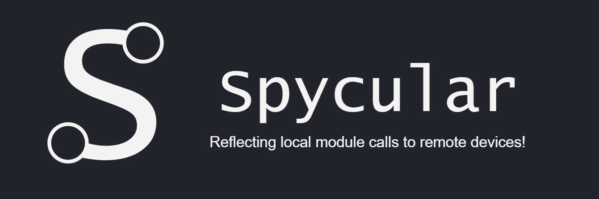

## Description

Drawing from the concept of specular reflection, Spycular is an advanced Python-based RPC framework designed for **seamless remote library integrations**.
Built with a vision to provide developers with unmatched **flexibility** and **control**, Spycular stands as a paragon of modern remote procedure call frameworks.

Spycular is meticulously crafted to offer:

- **Modular Communication Protocols**: Tailor the intercommunication mechanisms according to specific project requirements.
- **Configurable Serialization Methods**: A robust system allowing fine-tuned control over data serialization, catering to diverse data exchange scenarios.
- **Intelligent Remote Object Management**: Incorporating state-of-the-art algorithms and techniques, it ensures optimized handling and storage of objects on the remote end.

For full documentation visit our [Reference](https://ionesiojunior.github.io/Spycular/modules/consumer/abstract_consumer.html) page.
